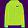
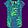
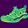
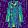
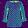
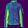

# 图像分类模型的对抗攻击和对抗训练

题目详见https://github.com/LC-John/Fashion-MNIST

### 分类器

分类器源码详见 `my_train.py`，该模型使用 tensorflow 2.1.0 搭建，训练出的模型保存为 `my_model.h5`。该分类器在测试集上的准确率为 **90.85%**。

### 白盒攻击

在我的分类器上对 1000 个样本分别进行 1000 次白盒攻击，成功率为 **87.7%**。

10 组攻击成功的样本如下图所示，图片文件位于 `my_white_attack` 文件夹。

|  |  |  |  |  |
| :----------------------------------------------------------: | :----------------------------------------------------------: | :----------------------------------------------------------: | :----------------------------------------------------------: | :----------------------------------------------------------: |
|                          2 Pullover                          |                            8 Bag                             |                           3 Dress                            |                           3 Dress                            |                           3 Dress                            |
|  |  |  |  |  |
|                          1 Trouser                           |                          7 Sneaker                           |                          2 Pullover                          |                          2 Pullover                          |                          2 Pullover                          |

|  |  |  |  |  |
| :----------------------------------------------------------: | :----------------------------------------------------------: | :----------------------------------------------------------: | :----------------------------------------------------------: | :----------------------------------------------------------: |
|                           3 Dress                            |                           5 Sandal                           |                           5 Sandal                           |                          7 Sneaker                           |                           6 Shirt                            |
|  |  |  |  |  |
|                          2 Pullover                          |                            4 Coat                            |                            4 Coat                            |                           6 Shirt                            |                           5 Sandal                           |

### 黑盒攻击

在提供的分类器上对 1000 个样本分别进行 1000 次黑盒攻击，成功率为 **60.4%**。

10 组攻击成功的样本如下图所示，图片文件位于 `black_attack` 文件夹。

|  |  |  |  |  |
| :----------------------------------------------------------: | :----------------------------------------------------------: | :----------------------------------------------------------: | :----------------------------------------------------------: | :----------------------------------------------------------: |
|                           3 Dress                            |                            8 Bag                             |                         9 Ankle boot                         |                           3 Dress                            |                           6 Shirt                            |
|  |  |  |  |  |
|                          2 Pullover                          |                          7 Sneaker                           |                            8 Bag                             |                          2 Pullover                          |                           5 Sandal                           |

|  |  |  |  |  |
| :----------------------------------------------------------: | :----------------------------------------------------------: | :----------------------------------------------------------: | :----------------------------------------------------------: | :----------------------------------------------------------: |
|                           3 Dress                            |                          1 Trouser                           |                         9 Ankle boot                         |                           3 Dress                            |                           6 Shirt                            |
|  |  |  |  |  |
|                          2 Pullover                          |                        0 T-shirt/top                         |                            8 Bag                             |                          2 Pullover                          |                           5 Sandal                           |

在我的分类器上对 1000 个样本分别进行 1000 次黑盒攻击，成功率为 **37.5%**。

10 组攻击成功的样本如下图所示，图片文件位于 `my_black_attack` 文件夹。

|  |  |  |  |  |
| :----------------------------------------------------------: | :----------------------------------------------------------: | :----------------------------------------------------------: | :----------------------------------------------------------: | :----------------------------------------------------------: |
|                            8 Bag                             |                          1 Trouser                           |                           6 Shirt                            |                        0 T-shirt/top                         |                           6 Shirt                            |
|  |  |  |  |  |
|                          7 Sneaker                           |                        0 T-shirt/top                         |                           5 Sandal                           |                         9 Ankle boot                         |                           5 Sandal                           |

|  |  |  |  |  |
| :----------------------------------------------------------: | :----------------------------------------------------------: | :----------------------------------------------------------: | :----------------------------------------------------------: | :----------------------------------------------------------: |
|                          1 Trouser                           |                        0 T-shirt/top                         |                           6 Shirt                            |                          1 Trouser                           |                          1 Trouser                           |
|  |  |  |  |  |
|                        0 T-shirt/top                         |                         9 Ankle boot                         |                           5 Sandal                           |                        0 T-shirt/top                         |                        0 T-shirt/top                         |

### 对抗训练

在新分类器上进行白盒攻击，成功率为 **75.7%**。其中 10 组攻击成功的样本如下图所示，图片文件位于 `my_new_white_attack` 文件夹。

|  |  |  |  |  |
| :----------------------------------------------------------: | :----------------------------------------------------------: | :----------------------------------------------------------: | :----------------------------------------------------------: | :----------------------------------------------------------: |
|                          1 Trouser                           |                            4 Coat                            |                            4 Coat                            |                            4 Coat                            |                           3 Dress                            |
|  |  |  |  |  |
|                        0 T-shirt/top                         |                           3 Dress                            |                           3 Dress                            |                           3 Dress                            |                          2 Pullover                          |

|  |  |  |  |  |
| :----------------------------------------------------------: | :----------------------------------------------------------: | :----------------------------------------------------------: | :----------------------------------------------------------: | :----------------------------------------------------------: |
|                            8 Bag                             |                          7 Sneaker                           |                           6 Shirt                            |                           3 Dress                            |                            4 Coat                            |
|  |  |  |  |  |
|                          7 Sneaker                           |                           6 Shirt                            |                           5 Sandal                           |                          2 Pullover                          |                           3 Dress                            |

在新分类器上进行黑盒攻击，成功率为 **88.6%**。其中 10 组攻击成功的样本如下图所示，图片文件位于 `my_new_black_attack` 文件夹。

|  |  |  |  |  |
| :----------------------------------------------------------: | :----------------------------------------------------------: | :----------------------------------------------------------: | :----------------------------------------------------------: | :----------------------------------------------------------: |
|                            8 Bag                             |                          2 Pullover                          |                        0 T-shirt/top                         |                           6 Shirt                            |                           5 Sandal                           |
|  |  |  |  |  |
|                          7 Sneaker                           |                          1 Trouser                           |                         9 Ankle boot                         |                           5 Sandal                           |                            4 Coat                            |

|  |  |  |  |  |
| :----------------------------------------------------------: | :----------------------------------------------------------: | :----------------------------------------------------------: | :----------------------------------------------------------: | :----------------------------------------------------------: |
|                           5 Sandal                           |                            8 Bag                             |                          2 Pullover                          |                        0 T-shirt/top                         |                           5 Sandal                           |
|  |  |  |  |  |
|                            4 Coat                            |                          7 Sneaker                           |                          1 Trouser                           |                         9 Ankle boot                         |                            4 Coat                            |

### 总结

新旧分类器的测试集准确率以及白盒黑盒攻击成功率如下表所示。

|                | 旧分类器 | 新分类器 |
| :------------: | :------: | :------: |
|  测试集准确率  |  90.85%  |  89.13%  |
| 白盒攻击成功率 |  87.7%   |  75.7%   |
| 黑盒攻击成功率 |  37.5%   |  88.6%   |

- 黑盒攻击所得样本噪声较大，而白盒攻击所得样本与原图相差无异。
- 通过对抗训练，新分类器在测试集上的准确率降低了，说明训练集的训练难度增加了。
- 在新分类器上，白盒攻击的成功率下降了，说明新分类器的性能和鲁棒性有所提升。
- 但对于新分类器的黑盒攻击成功率反而提高了，这也许是提高白盒攻击鲁棒性的负面影响，也可能是模型设置或攻击模式的外在原因。
